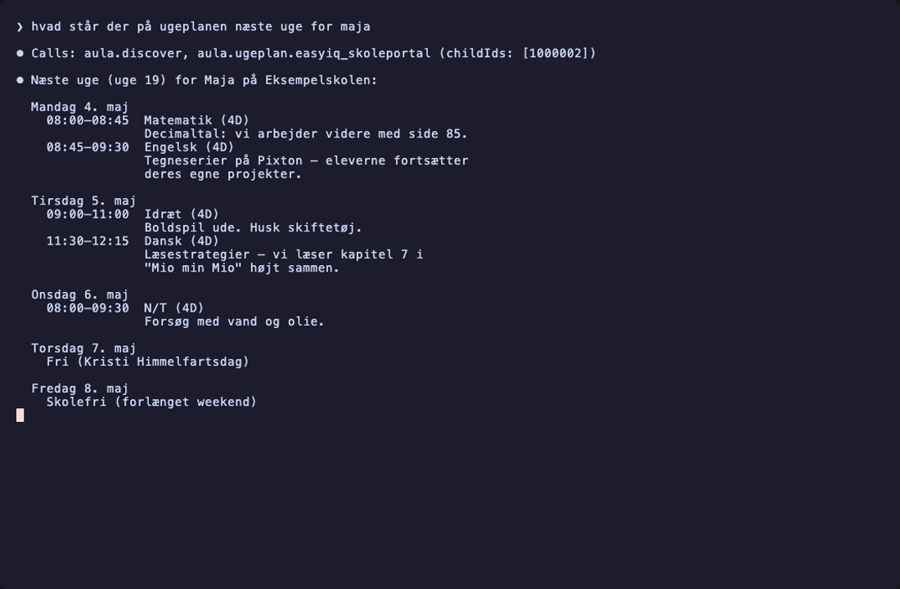
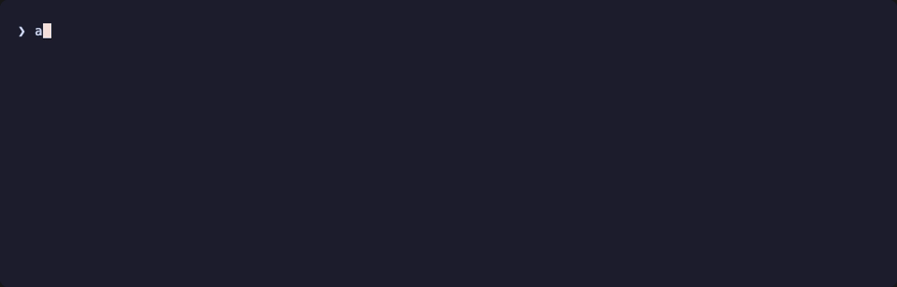

# aula-mcp

[](https://github.com/Casperjuel/aula-mcp/actions)
[](./LICENSE)

MCP server for [Aula](https://www.aula.dk) — the Danish school communication platform — so AI agents can read your kid's messages, calendar, ugeplaner, opgaver, and huskeliste through a typed interface.

TypeScript port of [`scaarup/aula`](https://github.com/scaarup/aula). Owns its own MitID auth (no headless browser, no Playwright). Exposes everything as Model Context Protocol tools over a Hono Streamable-HTTP server. Runs on Bun.

> **Disclaimer.** This project is not affiliated with, endorsed by, or sponsored by KMD A/S, Netcompany A/S, or the Aula consortium. *Aula* is a trademark of its respective owner; the name is used here solely to identify what this software talks to. All Aula data stays on your machine — there is no SaaS layer.

## Status

**v0.1 — works end-to-end on live Aula.** MitID login (APP method, QR), token refresh, the full Aula read API, the `aula.discover` MCP manifest, and live ugeplan retrieval (EasyIQ SkolePortal verified) are all running against production Aula traffic.

| Layer | What it does | Status |
| ----- | ------------ | ------ |
| `@aula-mcp/aula-auth` | MitID (APP / CODE_TOKEN / PASSWORD) + custom 3072-bit SRP-6a + OAuth/SAML chain + token store (file or macOS Keychain) + wire-trace debug | ✅ unit-tested + live-verified |
| `@aula-mcp/aula-client` | Aula API (profiles, presence, calendar, messages, notifications, posts) with version probing + widget token manager (#311 fix) + integration plugins (EasyIQ, EasyIQ SkolePortal, Meebook, Min Uddannelse, Systematic) | ✅ unit-tested |
| `@aula-mcp/mcp-server` | Hono + `@modelcontextprotocol/sdk` (`WebStandardStreamableHTTPServerTransport`) + `aula.discover` (with per-school provider auto-detection + `usage` hints for the agent) + 11 capability tools + raw-request escape hatch | ✅ unit-tested + live-verified with Claude Code |
| `apps/cli` | `aula login / status / whoami / doctor / log / transcript / logout`, MitID QR rendering, `--debug` wire-transcript capture | ✅ unit-tested |

**209 passing tests · CI green · daily MitID drift canary running.**

## Quickstart

Requires **[Bun](https://bun.sh) ≥ 1.3** and **[pnpm](https://pnpm.io) ≥ 10**. macOS or Linux. Node 22 is installed only for `tsc` type-checking.

```bash
git clone git@github.com:Casperjuel/aula-mcp.git
cd aula-mcp
pnpm install

# verify the build is healthy
pnpm typecheck && pnpm lint && bun test

# first-time MitID login (uses the MitID app via QR code by default)
pnpm --filter @aula-mcp/cli dev login

# health-check the whole pipeline
pnpm --filter @aula-mcp/cli dev doctor

# run the MCP server (listens on http://127.0.0.1:7878/mcp)
pnpm --filter @aula-mcp/mcp-server dev
```

Then point any MCP client at `http://127.0.0.1:7878/mcp`. See [`examples/claude-config/`](./examples/claude-config/) for a Claude Code / Claude Desktop snippet.

### Connecting to Claude Code

```sh
# 1. Start the server (leave running)
bun packages/mcp-server/src/server.ts

# 2. Register it with Claude Code (one-time)
claude mcp add --transport http aula http://127.0.0.1:7878/mcp

# 3. In any Claude Code session
/mcp                # confirm `aula` shows as connected
```

Then prompt naturally — kids' names get fuzzy-matched against the discover manifest, no IDs needed:

> hvad står der på ugeplanen næste uge for theo

Claude calls `aula.discover` once, picks the right ugeplan vendor for your school from `detectedWidgets`, and answers in your language with Danish-formatted dates.

### Connecting to claude.ai (web)

The web UI requires a public HTTPS URL — `127.0.0.1` won't work, the connection happens server-side from Anthropic's cloud. For a temporary tunnel:

```sh
cloudflared tunnel --url http://127.0.0.1:7878
# → use the printed https://…trycloudflare.com URL + /mcp
```

⚠️ The tunnel URL is publicly reachable while running — anyone who guesses it controls your Aula tokens. Fine for a quick test, don't leave it up. For permanent setup, deploy the server to a real host behind your own auth (Caddy / authenticated reverse proxy).

## CLI reference

```
aula login [--username <user>] [--method APP|CODE_TOKEN] [--debug]
           [--transcript <file>]
aula status [--json]
aula whoami [--json]
aula doctor [--json] [--verbose]
aula log [--last N] [--json]
aula transcript list [--json]
aula transcript view <file> [--json]
aula transcript prune [--keep N] [--dry-run]
aula logout
aula --help
```

| Command | What it does |
| ------- | ------------ |
| `aula login` | Walks the full MitID flow (APP method by default — scans QR with the MitID app). Saves tokens. `--debug` captures a sanitised wire transcript so failures are diagnosable. |
| `aula status` | Prints token presence, expiry, and active identity. Doesn't hit the network. Exit code 1 when no tokens. |
| `aula whoami` | Loads tokens (refreshes if needed), calls `getProfilesByLogin` + `getProfileContext`. Smoke test that the auth + client pipeline works end-to-end. |
| `aula doctor` | Walks every read endpoint (profiles, profile context, presence, messages, notifications, posts, widget token issuance) and reports per-call status with timing. The fastest "is this thing actually working?" check. `--verbose` dumps the wire transcript inline on failure. |
| `aula log` | Prints recent login attempts (success/failure, timestamps, error class). |
| `aula transcript {list,view,prune}` | Inspect captured `--debug` transcripts; prune old ones (default keep 10). |
| `aula logout` | Clears stored tokens. The encryption key file (file backend) is kept so the next login reuses it. |

### Token storage

| Platform | Default | Override |
| -------- | ------- | -------- |
| macOS | Keychain (`security` CLI; service `aula-mcp`, account `tokens`) | `AULA_MCP_NO_KEYCHAIN=1` falls back to the file backend |
| Linux / Windows | AES-256-GCM-encrypted file at `~/.config/aula-mcp/tokens.json` | `AULA_MCP_KEY=<hex|passphrase>` for the encryption key (else generated at `~/.config/aula-mcp/.key`, `chmod 600`) |

### Wire transcripts

`--debug` mode tees a JSONL transcript of every HTTP request/response to `~/.config/aula-mcp/transcripts/login-<timestamp>.jsonl`. Cookies, OAuth/SAML payloads, MitID auth codes, passwords, M1, flowValueProof, the `access_token` query param, and other secret fields are all redacted (`<redacted N chars>`). The transcript is safe to paste into a GitHub issue.

## Demo

Asking Claude Code about next week's school plan — one prompt, one MCP server, real Aula data:



Behind the scenes, the CLI ships a `doctor` that walks every Aula endpoint:


`whoami` shows the active identity + which children are tied to it:



Full CLI help and the shape of the `aula.discover` manifest:


Recordings are made with [VHS](https://github.com/charmbracelet/vhs); the children's names + institution codes shown above are synthetic. See [`docs/demos/`](./docs/demos/) for the tapes and the PII rules.

## The `aula.discover` tool

Agents call `aula.discover` once and get a typed manifest:

```ts
{
  user: { name, username, identityName? },
  children: [{ id, name, userId?, institution: { id, name?, code? } }],
  apiVersion: 23,
  tokens: { expires_at, seconds_remaining },
  detectedWidgets: ['0001', '0029', '0030'],   // from pageConfiguration
  capabilities: {
    profiles:      { summary, tools: ['aula.profiles.list'] },
    presence:      { summary, tools: ['aula.presence.today'] },
    calendar:      { summary, tools: ['aula.calendar.events'] },
    messages:      { summary, tools: ['aula.messages.list_threads', 'aula.messages.get_thread'] },
    notifications: { summary, tools: ['aula.notifications.list'] },
    posts:         { summary, tools: ['aula.posts.list'] },
    ugeplan:       { summary, tools: ['aula.ugeplan.easyiq'] },     // detected first
    opgaver:       { summary, tools: ['aula.opgaver.minuddannelse'] },
    ugebrev:       { summary, tools: ['aula.ugebrev.minuddannelse'] },
    huskelisten:   { summary, tools: ['aula.huskelisten.systematic'], notes: '<not detected>' }
  },
  rawRequestEnabled: false
}
```

The capability tool lists are reordered by `detectedWidgets` so the school's actually-configured providers come first. Capabilities for which no widget is detected get an inline `notes` line. New integrations become discoverable without changing the agent.

## Using the libraries from Node (no Bun)

The runtime split:

- `@aula-mcp/aula-auth` and `@aula-mcp/aula-client` use only Web standards + `node:crypto` + `node:child_process` (for the macOS Keychain). They run on Node ≥ 20 as well as Bun.
- `@aula-mcp/mcp-server` uses `Bun.serve` and is Bun-only.
- `apps/cli` uses Bun's TS support and `bun build --compile` for binaries.

To use the libraries from a Node script, see [`examples/script/`](./examples/script/).

## Architecture

```
packages/
  aula-auth/    — MitID + SRP + OAuth/SAML + token store + wire-trace
  aula-client/  — Aula API + integration plugins
  mcp-server/   — Hono + @modelcontextprotocol/sdk
apps/
  cli/          — aula login/status/whoami/doctor/log/transcript/logout
```

Cross-package imports use the workspace name (`@aula-mcp/aula-auth`) — Bun resolves `.ts` directly, so there's no build step in dev. `tsc -p tsconfig.json --noEmit` runs in CI for type-checking only.

Detailed design rationale: [docs/architecture.md](./docs/architecture.md).

## Bake-ins from upstream issues

The Python integration has years of accumulated lessons in its issue tracker. We pre-empted the top ones:

| Upstream issue / PR | Mitigation |
| ------------------- | ---------- |
| [#311](https://github.com/scaarup/aula/issues/311) — sensor goes dead when widget JWT expires | `WidgetTokenManager.withRetry` detects `{"message":"JWT-Token expired..."}` (and 401/403) and refreshes once before retrying. |
| [#246, #248](https://github.com/scaarup/aula/issues/246) — Aula API version drifts (v22 → v23 mid-life) | `AulaClient` probes versions lazily, retries once on 410, fires `onApiVersionChanged` on bumps. |
| [#310](https://github.com/scaarup/aula/issues/310) — RelayState missing from Level-3 SAML response | `extractSamlForm` returns `hadRelayState: false` and an empty string instead of throwing. |
| [#306, #287](https://github.com/scaarup/aula/issues/306) — `post-broker-login` returns 200 with confirmation form instead of 302 | `detectConfirmationForm` finds `button#confirmation-button`, submits its parent form, then continues. |
| [#290, #351](https://github.com/scaarup/aula/issues/351) — `password`/`token` required for auth methods that don't need them | `AulaLoginOptions` only demands fields per chosen `method`. APP method needs no password. |
| [PR #352](https://github.com/scaarup/aula/pull/352) — EasyIQ SkolePortal (widget 0128) | Implemented as `EasyIqSkoleportalClient` + `aula.ugeplan.easyiq_skoleportal` MCP tool. Per-child auth + Danish-entity decode. |
| Sensitive messages (`status.code` 403) | Surfaced as the typed `AulaStepUpRequiredError`; MCP tool returns a structured `step_up_required` JSON instead of empty data. |

## Troubleshooting

| Symptom | Likely cause / fix |
| ------- | ------------------ |
| `aula login` hangs after username prompt | The MitID app hasn't been opened yet, or the QR codes haven't rendered (terminal too narrow). Make sure your terminal is ≥ 80 cols. |
| `Login failed: MitID initialize failed (status …)` | nemlog-in.mitid.dk is unreachable or returned an error. Re-run with `--debug` and inspect the transcript. |
| `Login failed: APP poll error: …` | The MitID app rejected or cancelled. Check that the MitID app is logged into your account. |
| `Login failed: appProve failed (status …)` | Rare — MitID rejected the SRP proof. Re-run with `--debug` and inspect `~/.config/aula-mcp/transcripts/login-<timestamp>.jsonl`. |
| `aula whoami` → `step_up_required` for messages | A specific thread is sensitive (Aula returns 403). Re-run `aula login` to re-establish a step-up session, then retry. |
| `aula doctor` says `Aula API v22 → 410` | The API version has bumped. Run `aula doctor` again — `AulaClient` will probe forward and remember. |
| `aula status` shows `expired N min ago` | Tokens expired since last use. Any read call (or `aula doctor`) will refresh them automatically. |
| MCP server: `Refusing to bind to non-loopback address` | You set `AULA_MCP_HOST` to `0.0.0.0` or similar. The server is single-user; anyone hitting `/mcp` becomes you. Set `AULA_MCP_ALLOW_REMOTE=1` if you understand the implications. |

When something fails, the JSONL transcript at `~/.config/aula-mcp/transcripts/login-<timestamp>.jsonl` (after `--debug`) is the first thing to look at. `aula transcript view <file>` pretty-prints it.

## Development

```bash
pnpm install          # install everything
pnpm typecheck        # tsc -p tsconfig.json --noEmit
pnpm lint             # biome check .
pnpm lint:fix         # biome check --write .
bun test              # run the bun:test suites (209 cases at last count)
bun test --coverage   # also produces a coverage table
```

A full guide for adding integration plugins or porting more endpoints is in [CONTRIBUTING.md](./CONTRIBUTING.md).

## Privacy

All tokens stay on your machine. The MCP server runs on `localhost` by default — no external dependencies. The wire-trace tooling is opt-in (`--debug` flag) and redacts every known-secret field.

The reference Python repo is for personal/family use of one's own children's school data. This project is the same — log in as yourself with your own MitID; do not use to access anyone else's account.

## Contributing

See [CONTRIBUTING.md](./CONTRIBUTING.md) for repo layout, conventions, and a guide for adding integration plugins. Contributors agree to follow the [Code of Conduct](./CODE_OF_CONDUCT.md). Security issues: please email **cj@signifly.com** rather than opening a public issue — see [SECURITY.md](./SECURITY.md).

## License

[MIT](./LICENSE).
